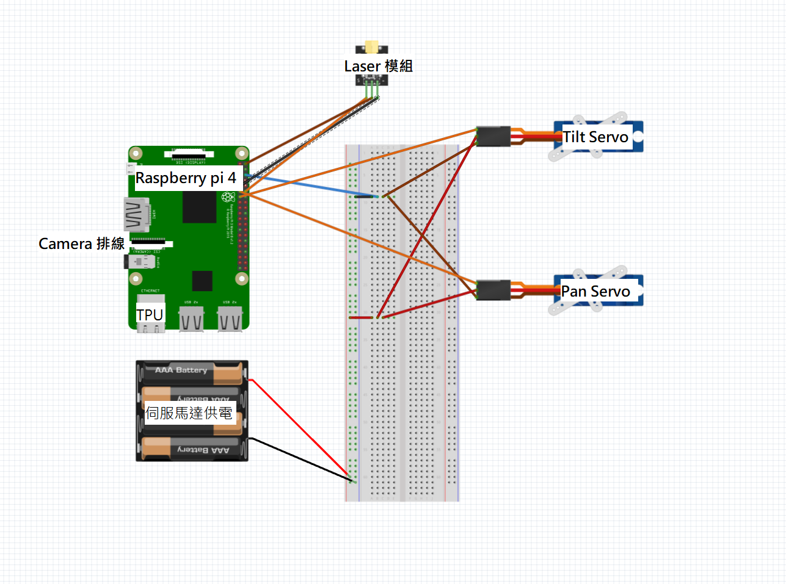

# 🐱 Pi Laser Cat Toy (AI 驅動)

這是一個基於 Raspberry Pi 4、Google Coral Edge TPU 和電腦視覺技術所打造的自動雷射逗貓玩具。


[](https://www.youtube.com/watch?v=SDhNb0hm5_w)

## ✨ 功能特色

- **AI 追蹤**: 使用 MobileNet SSD v2 (Edge TPU 加速) 即時偵測並追蹤貓咪 (~20 FPS)。
- **智慧安全**: 
    - **閃避機制**: 當雷射點太靠近貓咪時，系統會自動關閉雷射並將伺服馬達移開。
    - **冷卻時間**: 避免頻繁重複觸發雷射。
- **平滑運動**: 使用 PID 控制器搭配 `pigpio` 硬體計時，消除伺服馬達的抖動問題。
- **網頁介面**: 提供即時影像串流、手動搖桿控制，以及透過 Flask 網頁應用程式進行參數設定。

## 🛠️ 硬體需求

- **Raspberry Pi 4** (建議 2GB+ RAM)
- **Google Coral USB Accelerator** (高 FPS 必備)
- **Pi Camera 模組** (支援 v1/v2/v3)
- **Pan/Tilt 伺服馬達套件** (SG90 伺服馬達)
- **雷射二極體** (透過 GPIO 控制)
- **外部 5V 電源** (強烈建議用於伺服馬達獨立供電)

## 🔌 硬體架設與接線 (Hardware Setup & Wiring)

為了確保 AI 追蹤時的穩定性並消除伺服馬達抖動 (Jitter)，本專案採用 **電源隔離 (Power Isolation)** 設計。

### 接線邏輯圖


### 📌 關鍵腳位對照表 (Pinout)

| 元件 (Component) | 功能 | BCM (程式設定) | 實體腳位 (Physical) | 備註 |
| :--- | :--- | :--- | :--- | :--- |
| **Pan Servo (下/水平)** | PWM 訊號 | **GPIO 27** | Pin 13 | 負責左右轉動 |
| **Tilt Servo (上/垂直)** | PWM 訊號 | **GPIO 17** | Pin 11 | 負責上下點頭 |
| **Laser Module (雷射)** | 開關訊號 | **GPIO 18** | Pin 12 | Active High |
| **Pi Camera (相機)** | 影像訊號 | **CSI Port** | CSI 介面 | 藍色面朝向網路孔 |
| **GND (共地)** | 接地 | - | Pin 6 | **必須連接** |

### ⚠️ 重要安全注意事項

1.  **電源隔離 (Power Isolation)**：
    * **伺服馬達 (Servos)** 由 **4xAAA 電池盒 (6V)** 獨立供電。
    * **Raspberry Pi** 由原本的 USB-C 供電。
    * **絕對不要** 將電池盒的紅線 (+) 接到樹莓派的 5V 腳位，這會導致樹莓派燒毀。

2.  **共地 (Common Ground)**：
    * 務必將電池盒的 **黑線 (-)** 與樹莓派的 **GND (Pin 6)** 連接。
    * 如果沒有共地，控制訊號將無法傳輸，馬達會亂轉或不動。

3.  **驅動程式**：
    * 此接線配置配合 `pigpio` 驅動程式效果最佳。請確保已執行 `sudo pigpiod`。

## � 專案文件 (Documentation)

為了讓您更容易上手，我們將教學分為兩部分：

1.  **🛠️ [硬體組裝指南 (Hardware Guide)](docs/hardware.md)**
    *   如何組裝伺服馬達支架
    *   雷射頭固定方式
    *   相機架設位置
    *   *(內含組裝照片與步驟)*

2.  **💻 [軟體安裝指南 (Software Setup)](docs/setup_guide.md)**
    *   驅動程式安裝 (Pigpio, Edge TPU)
    *   Python 環境設定
    *   常見問題排除

## 🔌 硬體架設與接線 (Hardware Setup & Wiring)

### 快速摘要
1.  **安裝驅動**: `pigpio` (伺服馬達) 和 `libedgetpu` (AI)。
2.  **設定 Python**: 建立帶有 `--system-site-packages` 參數的虛擬環境。
3.  **執行**: `python3 app.py`

## 🎮 使用方法

1.  啟動系統:
    ```bash
    # (建議) 設定開機自動啟動 Pigpio Daemon，這樣以後就不用每次打這行
    sudo systemctl enable pigpiod
    sudo systemctl start pigpiod
    
    # 啟動應用程式
    source venv/bin/activate
    python3 app.py
    ```
2.  打開瀏覽器並前往 `http://<your-pi-ip>:5000`。
3.  **選擇模式**:
    *   **🤖 自動模式 (AUTO)**: 點擊 `Start Auto`，AI 會自動偵測貓咪並控制雷射。
    *   **🕹️ 手動模式 (MANUAL)**: 使用網頁上的虛擬搖桿 (Joystick) 直接控制伺服馬達，享受親自逗貓的樂趣！

## 🎯 校正與安全邏輯 (Calibration & Safety)

在開啟自動模式前，您需要先進行簡單的校正，讓系統知道「雷射現在指哪裡」。

### 1. 視角校正 (Calibration)
*   **黃框 (ROI)**: 代表系統預測「雷射點目前在畫面上的位置」。
*   **操作**: 在網頁介面上，手動移動雲台，並觀察黃框是否大致跟隨雷射點。如果不準，請在 `config.json` 或網頁設定中調整偏移量。
*   **邊界限制**: 除了硬體極限 (`pan_limits_deg`)，您也可以設定實際應用場景的邊界，防止雷射照到牆壁高處或家具外。

### 2. 安全觸發機制 (Safety Trigger)
系統會持續監控 **黃框 (雷射)** 與 **紅框 (貓咪)** 的關係：

*   **🟢 安全 (Safe)**: 黃框與紅框距離夠遠。雷射正常開啟，追逐貓咪。
*   **🔴 危險 (Danger)**: 當 **黃框 (雷射)** 接觸或進入 **紅框 (貓咪)** 範圍時：
    1.  **立即關閉雷射**: 防止照射眼睛。
    2.  **緊急閃避 (Evade)**: 伺服馬達會計算反向向量，迅速移開。
    3.  **冷卻 (Cooldown)**: 暫停一小段時間，確認安全後才重新開啟。

## ⚙️ 詳細設定說明 (`config/config.json`)

您可以透過修改此檔案來調整系統行為。

### 1. Servos (伺服馬達)
| 參數 | 說明 | 預設值 |
| :--- | :--- | :--- |
| `driver` | 驅動模式。`pigpio` (推薦，無抖動) 或 `gpio` (備用)。 | `pigpio` |
| `pan_limits_deg` | 水平旋轉角度限制 `[min, max]`。 | `[20, 160]` |
| `tilt_limits_deg` | 垂直旋轉角度限制 `[min, max]`。 | `[20, 140]` |

### 2. Safety (安全機制)
| 參數 | 說明 | 預設值 |
| :--- | :--- | :--- |
| `danger_margin_px` | 貓咪 BBox 周圍的危險緩衝區 (像素)。雷射進入此範圍即觸發閃避。 | `50` |
| `cooldown_ms` | 閃避後的冷卻時間 (毫秒)，期間雷射保持關閉。 | `2000` |

### 3. Auto Loop (自動逗貓邏輯)
| 參數 | 說明 | 預設值 |
| :--- | :--- | :--- |
| `cooldown_sec` | 每次命中目標後的暫停時間 (秒)。 | `1.2` |
| `retarget.pan_jitter_deg` | 隨機移動時的水平最大角度變化。 | `10` |
| `retarget.tilt_jitter_deg` | 隨機移動時的垂直最大角度變化。 | `6` |
| `safety.servo_settle_ms` | 伺服馬達移動後的穩定等待時間 (毫秒)，防止畫面模糊影響偵測。 | `250` |

### 4. Laser (雷射)
| 參數 | 說明 | 預設值 |
| :--- | :--- | :--- |
| `gpio_pin` | 雷射控制腳位 (BCM 編號)。 | `18` |
| `max_on_ms` | 雷射單次最長開啟時間 (毫秒)，超時會強制關閉並重新選點。 | `800` |

### 5. Detector (AI 偵測)
| 參數 | 說明 | 預設值 |
| :--- | :--- | :--- |
| `current` | 使用的偵測器。`tflite` (真實) 或 `mock` (模擬)。 | `tflite` |
| `tflite.backend` | 推論後端。`tpu` (Coral USB) 或 `cpu`。 | `tpu` |
| `tflite.threshold` | 信心分數門檻 (0.0 - 1.0)。 | `0.3` |
| `tflite.target_classes` | 追蹤的物件標籤清單。 | `["cat"]` |

## 📂 程式運作原理 (How it Works)

如果您想了解程式碼是如何運作的，可以參考以下簡單的分類：

### 🧠 大腦 (Logic)
*   **`modules/auto_pilot.py`**: 這是整個系統的核心指揮官。它決定現在要「追蹤貓咪」、「閃避危險」還是「休息冷卻」。
*   **`modules/safety.py`**: 負責計算安全距離。它會確保雷射點永遠不會直接照射到貓咪的眼睛或身體。

### 👁️ 眼睛 (Vision)
*   **`modules/detector_tflite.py`**: 使用 AI 模型 (透過 Coral TPU 加速) 來分析畫面，告訴系統「貓咪在哪裡」。
*   **`modules/camera.py`**: 負責控制 Pi Camera 拍照和錄影，並將畫面傳送給 AI 和網頁。

### 🦾 手腳 (Hardware)
*   **`modules/servo_controller.py`**: 負責控制伺服馬達 (Pan/Tilt) 的轉動。
*   **`modules/servo_driver.py`**: 底層驅動程式，確保馬達轉動時平滑且不會抖動 (Anti-jitter)。
*   **`modules/laser_controller.py`**: 簡單的開關，負責控制雷射頭的亮滅。

### 🌐 介面 (Interface)
*   **`app.py`**: 這是主程式入口。它啟動了一個網頁伺服器，讓您可以用手機或電腦瀏覽器看到即時畫面，並手動控制雷射。

## 🤝 致謝 (Acknowledgements)

特別感謝 [Google Coral Camera Examples](https://github.com/google-coral/examples-camera) 專案。本專案的視覺偵測核心 (Vision Module) 係基於其高效能的範例程式碼進行改寫與整合，以實現 Edge TPU 的即時推論能力。

## 🔗 參考資料 (References)

- **Google Coral Edge TPU**: [官方安裝指南](https://coral.ai/docs/accelerator/get-started/)
- **Google Coral Examples**: [GitHub Repository (Detection Module Source)](https://github.com/google-coral/examples-camera)
- **Pigpio Library**: [官方文件](http://abyz.me.uk/rpi/pigpio/)
- **Raspberry Pi**: [官方文件](https://www.raspberrypi.org/documentation/)
