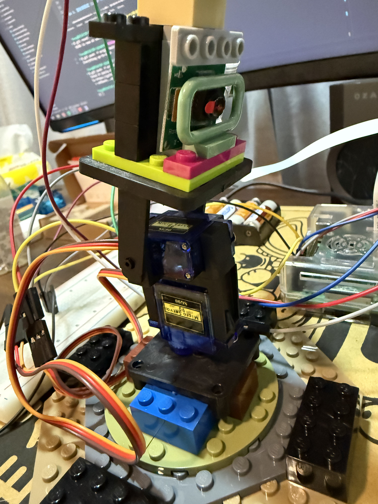
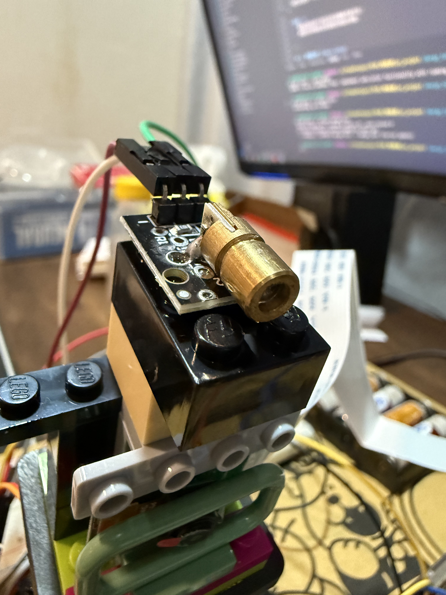
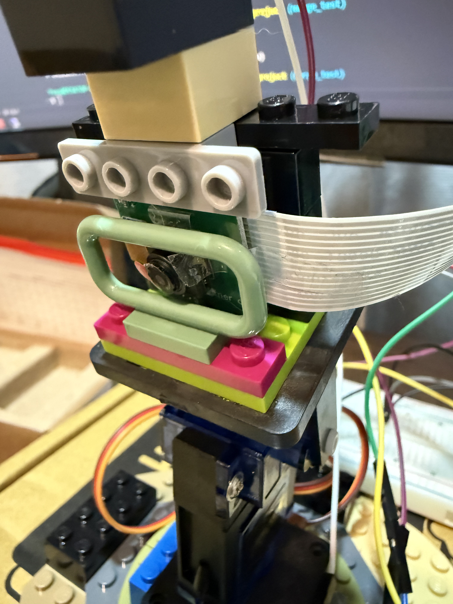
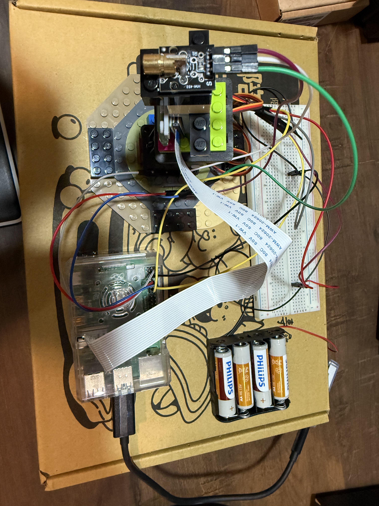

# 🛠️ 硬體組裝指南 (Hardware Assembly Guide)

本指南將引導您完成 Pi Laser Cat Toy 的實體組裝。

## 1. 準備材料 (BOM)

*   **核心**: Raspberry Pi 4 Model B
*   **AI 加速**: Google Coral USB Accelerator
*   **視覺**: Raspberry Pi Camera (v2 或 v3)
*   **機構**: Pan/Tilt 伺服馬達支架 (SG90 x2)
*   **雷射**: 5V/3.3V 雷射二極體模組
*   **電源**: 
    *   USB-C (給 Pi)
    *   4xAAA 電池盒 (給伺服馬達)
*   **其他**: 杜邦線、麵包板或洞洞板、3D 列印外殼 (選配)

---

## 2. 伺服馬達支架組裝 (Pan/Tilt Mount)

這部分是專案的機械核心，負責雷射的轉動。

**步驟：**
1.  將下層伺服馬達 (Pan) 固定在底座上。
2.  將上層伺服馬達 (Tilt) 固定在 Pan 馬達的搖臂上。
3.  確保兩個馬達的初始位置都設在 **90度 (中間點)**。

---

## 3. 雷射頭固定 (Laser Mounting)

雷射頭需要固定在 Tilt (上層) 馬達的末端。

**注意：**
*   請確認雷射線不會因為馬達轉動而被拉扯。
*   建議使用熱縮套管保護雷射模組的接點。

---

## 4. 相機架設 (Camera Setup)

相機需要固定在一個能看到雷射投射區域的位置。通常建議架設在高處，俯視地板。

**⚠️ 接線注意：**
*   Pi Camera 的排線 (Ribbon Cable) **藍色面 (Blue Side)** 必須朝向 Raspberry Pi 的 **網路孔 (Ethernet Port)** 方向插入。
*   插反會導致無法偵測到相機。

---

## 5. 整體連接 (Final Assembly)

將所有元件連接到 Raspberry Pi 和麵包板上。

### 接線圖參考

